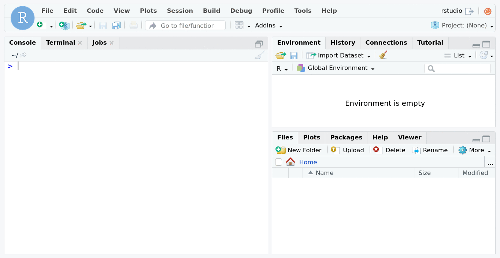

# structured
<!-- badges: start -->
[](https://open.vscode.dev/GiuseppeTT/structured)
[](https://github.com/GiuseppeTT/structured/actions)
[](https://github.com/GiuseppeTT/structured/actions)
[](https://www.tidyverse.org/lifecycle)
<!-- badges: end -->

`structured` is a tool to create structured R projects. It contains fully documented templates to automate your project creation process.

## Useful links
Some useful links:

- Documentation: https://giuseppett.github.io/structured
- Description of structures (project templates): https://giuseppett.github.io/structured/articles/structures.html
- Example of projects built with `{structured}`: https://github.com/GiuseppeTT/structured-examples
- GitHub: https://github.com/GiuseppeTT/structured

## Installation
Paste these commands in your R console:

```r
install.packages("remotes")
remotes::install_github("GiuseppeTT/structured")
```

## Usage
### In RStudio


Follow these steps:

1. In the top bar, click "File" and then "New Project..."
1. Select "New Directory"
1. Scroll down, select either "Basic Structured Project" or "Intermediate Structured Project"
1. Type a name in "Directory name:" for your project folder
1. Choose a folder in "Create project as subdirectory of:" to be the parent directory of your project folder
1. Select one of the project types in "Project type:"
1. Click "Create Project"

That's it! You can start coding now.

### In R console
**Modify** and paste these commands in your R console:

```r
library(structured)

# path can be either a relative or an absolute path
#
# level must be one of:
# - "Basic"
# - "Intermediate"
#
# type must be one of:
# - "Script"
# - "R Markdown (Simplified)"
# - "R Markdown"
# - "Targets"
# - "Shiny"
# - "None"
#
# if open is TRUE, open the project (if on RStudio) or simply set the working
# directory (if not on RStudio). Else, do nothing.
structure_project(
    path = "cool-project",
    level = "Basic",
    type = "Script",
    open = TRUE
)
```

That's it! You can start coding now.

## Acknowledgements

`{structured}` was heavily influenced by "set up tools" like the [`{usethis}`](https://usethis.r-lib.org/) R package and the [`{cookiecutter}`](https://cookiecutter.readthedocs.io) python package.
